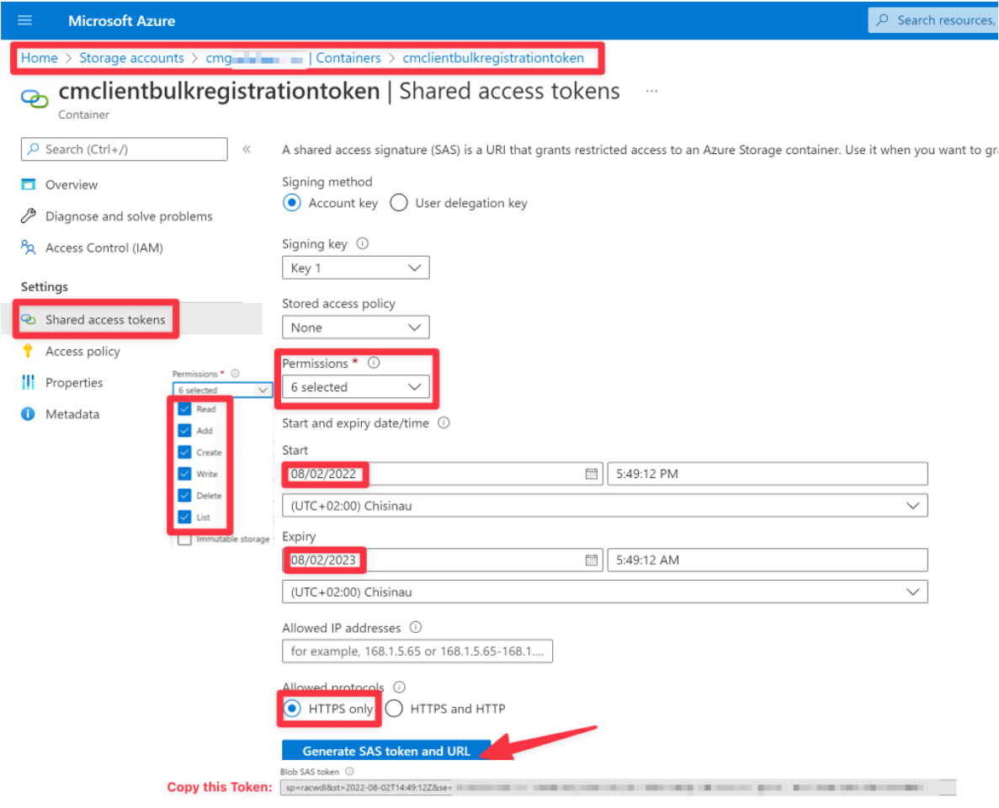
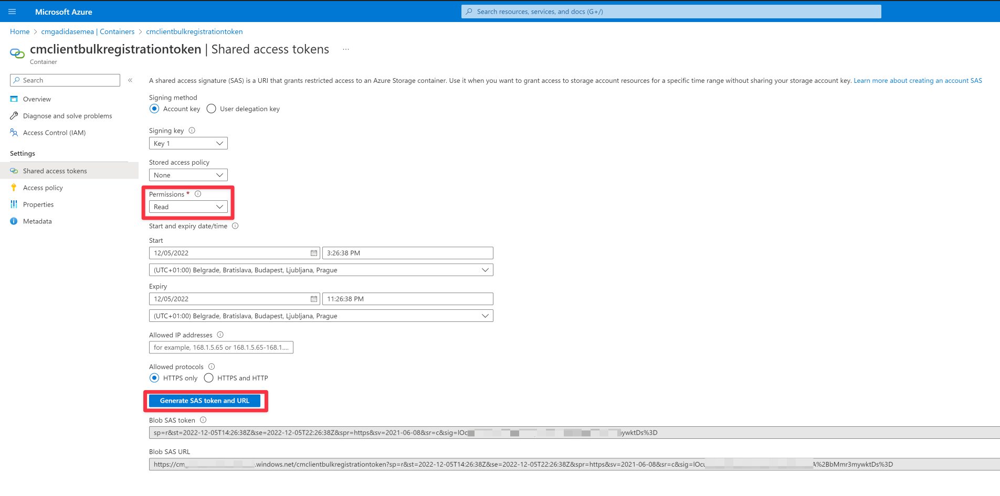

# Invoke-CCMSetupBulkRegistrationToken Script

## Description

Automates Configuration Manager Bulk Registration Token generation and usage during OSD trough the Cloud Management Gateway with a Standalone Media and no connection to the Configuration Manager site.

## Use Case

Off-site OSD without connection to Configuration Manager Site and low bandwidth constrains.

## Design

The solution consists of two powershell scripts and two scheduled taks.

### New-CMClientBulkRegistrationToken `[Script]`

Handles the generation and upload of the Token to Azure Blob Storage. This script needs to run on the site server.

```PowerShell
<#
.SYNOPSIS
    Generates a new MEMCM Client Bulk Registration Token.
.DESCRIPTION
    Generates a new MEMCM Client Bulk Registration Token, and optionally uploads it to Azure Blob Storage.
.PARAMETER Lifetime
    Specifies the Lifetime in minutes for the generated token.
    Default value is 1440 minutes (1 day).
.PARAMETER File
    Specifies the path to export the token file.
.PARAMETER Url
    Specifies the blob to upload the token file URL.
.PARAMETER SasToken
    Specifies the azure blob SAS token. Specifies the azure blob SAS token. If this parameter is not specified, no authentication is used.
.EXAMPLE
    New-CMClientBulkRegistrationToken.ps1 -Lifetime 10 -File 'C:\temp\token.json'
.EXAMPLE
    New-CMClientBulkRegistrationToken.ps1 -Lifetime 10 -File 'C:\temp\token.json' -Url 'https://mystorageaccount.blob.core.windows.net/mycontainer' -SasToken '?sv=2015-12-11&st=2017-01-01T00:00:00Z&se=2017-01-01T00:00:00Z&sr=c&sp=rw&sig=mySasToken'
#>
```

>Notes
>This script should be scheduled to run at intervals less than the Lifetime of the token in order for the token to be always valid when retrieved. Meaning that if you specify a Lifetime of 12 hours the script should be scheduled to run every 11 hours for example.
>The SasToken should not have a validity longer than a year and there should be controls put in place to ensure its renewal once it expires.

### Invoke-CCMSetupBulkRegistrationToken `[Script]`

```PowerShell
<#
.SYNOPSIS
    Invokes CCMSetup.exe with an MEMCM bulk client registration Token.
.DESCRIPTION
    Invokes CCMSetup.exe from %SystemRoot%\ccmsetup with an MEMCM bulk client registration Token stored in Azure Blob Storage.
    The installation is scheduled as a one time scheduled task on first boot.
.PARAMETER Url
    Specifies the blob to upload the token file URL.
.PARAMETER SasToken
    Specifies the azure blob SAS token. Specifies the azure blob SAS token. If this parameter is not specified, no authentication is used.
.PARAMETER CMGAddress
    Specifies the Cloud Management Gateway address. Do not specify 'https://' prefix.
.PARAMETER SMSSITECODE
    Specifies the SMS site code. To be used if the computer is workgroup joined.
.PARAMETER SMSMP
    Specifies the SMS management point. To be used if the computer is workgroup joined.
.PARAMETER RESETKEYINFORMATION
    Specifies whether to reset the key information. To be used if the computer is workgroup joined.
.PARAMETER SMSPublicRootKey
    Specifies the SMS public root key. You can find it in the mobile.ctf file. To be used if the computer is workgroup joined.
.PARAMETER UninstallClientFirst
    Specifies whether to uninstall the client first. To be used if the computer is workgroup joined.
.EXAMPLE
    Invoke-CCMSetupBulkRegistrationToken.ps1 -Url 'https://mystorage.blob.core.windows.net/mycontainer' -SasToken '?sv=2015-12-11&st=2017-01-01T00:00:00Z&se=2017-01-01T00:00:00Z&sr=c&sp=rw&sig=mySasToken' -CMGAddress 'mycmg.domain.com/CCM_Proxy_MutualAuth/72057594037928022'
.EXAMPLE
    [hashtable]$Parameters = @{
        [string]$Url                   = 'https://company.blob.core.windows.net/memcmtoken/New-CMClientBulkRegistrationToken.json'
        [string]$SASToken              = 'sp=racwd&st=2022-06-22T06:00:00Z&se=2023-06-22T06:00:00Z&spr=https&sv=2021-06-08&sr=c&sig=6Wn1nYb0aj9pwdf0FRhviF3EwVwewk5tv22qbqwQZuc%3D'
        [string]$CMGAddress            = 'CMG.COMPANY.COM/CCM_Proxy_MutualAuth/72067594037928032'
        [string]$SMSSITECODE           = 'ABC'
        [string]$SMSMP                 = 'https://MP.COMPANY.COM'
        [string]$RESETKEYINFORMATION   = 'TRUE'
        [string]$SMSPublicRootKey      = '0602000000A40000525341210008000001000100930194140D96A30D15588A99CF57E5ADDB2A8199C7B6057B066CE8F52C49979D96EC8DB75B26E610A93D98BB19999...'
        [boolean]$UninstallClientFirst = $true
    }
    Invoke-CCMSetupBulkRegistrationToken.ps1 @Parameters
#>
```

>Notes
>The Url needs to include the blob path and the FileName with the extension used in the New-CMBulkRegistrationToken.ps1 script.
The CMGAddress can be retrieved with the following PowerShell command on the site server:
`(Get-CimInstance -Namespace Root\Ccm\LocationServices -Class SMS_ActiveMPCandidate | Where-Object {$PSItem.Type -eq 'Internet'}).MP`
Do not specify `https://` prefix.

### New-CMClientBulkRegistrationToken `[Scheduled Task]`

Handles the Generation of the Token and Upload to Azure by triggering the New-CMClientBulkRegistrationToken. You can find a template below.

```xml
<?xml version="1.0" encoding="UTF-16"?>
<Task version="1.4" xmlns="http://schemas.microsoft.com/windows/2004/02/mit/task">
    <RegistrationInfo>
        <Date>2021-09-03T17:04:05.0561221</Date>
        <Author>Administrator</Author>
        <Description>Generates a new MEMCM Client Bulk Registration Token, and optionally uploads
it to Azure Blob Storage. Unfortunately bulkregistrationtokentool.exe requires User Context to run so this task will run only if someone from the 'Specific Group' is logged in.</Description>
        <URI>\New-CMClientBulkRegistrationToken</URI>
    </RegistrationInfo>
    <Triggers>
        <CalendarTrigger>
            <StartBoundary>2022-08-03T08:00:00</StartBoundary>
            <ExecutionTimeLimit>PT1H</ExecutionTimeLimit>
            <Enabled>true</Enabled>
            <ScheduleByDay>
                <DaysInterval>1</DaysInterval>
            </ScheduleByDay>
        </CalendarTrigger>
    </Triggers>
    <Principals>
        <Principal id="Author">
            <GroupId>S-1-5-32-545</GroupId>
            <RunLevel>HighestAvailable</RunLevel>
        </Principal>
    </Principals>
    <Settings>
        <MultipleInstancesPolicy>IgnoreNew</MultipleInstancesPolicy>
        <DisallowStartIfOnBatteries>false</DisallowStartIfOnBatteries>
        <StopIfGoingOnBatteries>false</StopIfGoingOnBatteries>
        <AllowHardTerminate>true</AllowHardTerminate>
        <StartWhenAvailable>true</StartWhenAvailable>
        <RunOnlyIfNetworkAvailable>true</RunOnlyIfNetworkAvailable>
        <IdleSettings>
            <StopOnIdleEnd>false</StopOnIdleEnd>
            <RestartOnIdle>false</RestartOnIdle>
        </IdleSettings>
        <AllowStartOnDemand>true</AllowStartOnDemand>
        <Enabled>true</Enabled>
        <Hidden>true</Hidden>
        <RunOnlyIfIdle>false</RunOnlyIfIdle>
        <DisallowStartOnRemoteAppSession>false</DisallowStartOnRemoteAppSession>
        <UseUnifiedSchedulingEngine>true</UseUnifiedSchedulingEngine>
        <WakeToRun>false</WakeToRun>
        <ExecutionTimeLimit>PT1H</ExecutionTimeLimit>
        <Priority>7</Priority>
        <RestartOnFailure>
            <Interval>PT10M</Interval>
            <Count>6</Count>
        </RestartOnFailure>
    </Settings>
    <Actions Context="Author">
        <Exec>
            <Command>C:\Windows\System32\WindowsPowerShell\v1.0\powershell.exe</Command>
            <Arguments>.\New-CMClientBulkRegistrationToken.ps1 -Lifetime 1500 -File 'D:\Scripts\New-
CMClientBulkRegistrationToken\New-CMClientBulkRegistrationToken.json' -Url 'https://storageaccount.blob.core.windows.net/cmclientbulkregistrationtoken' -SasToken 'Your SASToken'</Arguments>
            <WorkingDirectory>E:\Scripts\New-CMClientBulkRegistrationToken</WorkingDirectory>
        </Exec>
    </Actions>
</Task>
```

>Notes
>Since the Bulk Registration Tool needs to run interactively a user needs to be logged on the server in order for the scheduled task to run succefully. I have not found a workaround for this limitation. I've set for example the `ConfigurationManagerAdmins` group so if anyone from the team is logged when the task is triggered, the script will run succesfully.

### Invoke-CCMSetupBulkRegistrationToken `[Scheduled Task]`

Self creating/deleting Scheduled Task that runs once on first boot triggering %SystemRoot% \CCMSetup\CCMSetup.exe using the Token and CMG installation properties.

## Prerequisites

* Azure Storage Account and blob container
* SAS readonly rights key for the blob container

## Implementation

### Create Azure Storage Account and Blob Container

* Create an Azure Storage Account
* Select the Storage Account and go to containers --> `Create New Container` for example `cmclientbulkregistrationtoken`

### Generate SAS token For New-CMClientBulkRegistrationToken `[Scheduled Task]`

* Select `cmclientbulkregistrationtoken` container and go to `Shared Access Tokens`
* Permissions --> `Read`, `Add`, `Create`, `Write`, `Delete` `List`
* Validity --> Set whatever you want there but I would use something like 6 months to 1 year. Do not save this token! Use it only in the `New-CMClientBulkRegistrationToken` scheduled task and secure access to your Configuration Manager server. Anyone with this token can use it to replace your BulkRegistrationToken with their own.
* Click `Generate SAS token and URL`
* Copy `Blob SAS token`
* Copy `Blob SAS URl` until the `?` character

### Generate SAS Token For Invoke-CCMSetupBulkRegistrationToken `[Script]`

* Select `cmclientbulkregistrationtoken` container and go to `Shared Access Tokens`
* Permissions --> `Read`
* Validity --> Set whatever you want there but I would use something like 6 months to 1 year.
* Click `Generate SAS token and URL`
* Copy `Blob SAS token`
* Copy `Blob SAS URl` until the `?` character

### Server Configuration

* Copy the `New-CMClientBulkRegistrationToken.ps1` in a folder on the Site Server.
* Import the `New-CMClientBulkRegistrationToken.xml` scheduled task and modify the parameters and group using the **New-CMClientBulkRegistrationToken** `[Scheduled Task]` SAS token info. Use a user group that has rights to generate the token and whose members are more likely to be logged on.

### Task Sequence Configuration

* Edit the inline parameters for the `Invoke-CCMSetupBulkRegistrationToken.ps1` script using the **Invoke-CCMSetupBulkRegistrationToken** `[Script]` information.
* Add a `Run PowerShell Script` step at the very end of the Task Sequence and paste the modified `Invoke-CCMSetupBulkRegistrationToken.ps1` script. You don't need a payload.

## Screenshoots

<figure>


<figcaption align = "center"><b>Token Generation and Upload Demo</b></figcaption>
</figure>

<figure>


<figcaption align = "center"><b>Azure Storage Container</b></figcaption>
</figure>

<figure>



<figcaption align = "center"><b>Token Upload Permissions</b></figcaption>
</figure>

<figure>



<figcaption align = "center"><b>Token Read Permissions</b></figcaption>
</figure>

<figure>


<figcaption align = "center"><b>Task Sequence Script Step</b></figcaption>
</figure>
